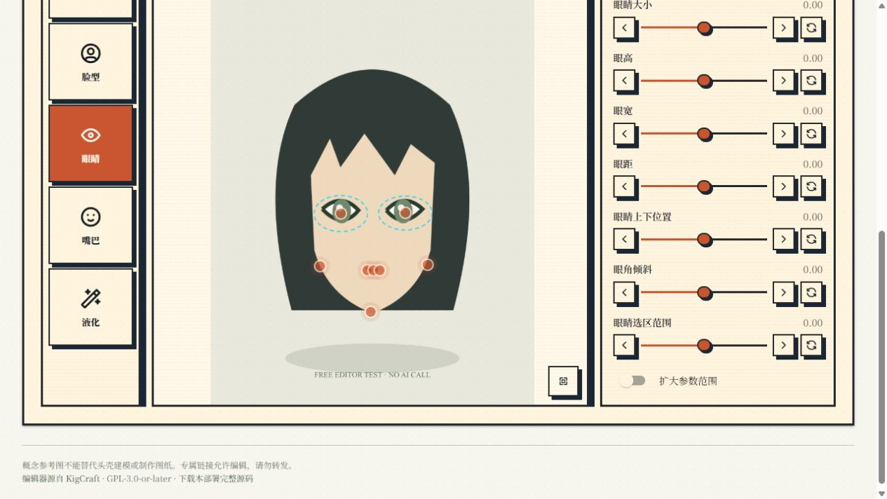

# 本次验证记录

2026-10-08：GitHub 发布前重新通过 32 项本地自动测试及前端 TypeScript / Vite 正式构建。测试使用模拟 FAL，未产生付费调用；部署配置、任务数据、依赖和构建产物均不纳入 Git 源码。

2026-10-07：新增 `BUDGET_LIMIT_ENABLED`，支持关闭累计调用次数与美元预留额的测试上限，编辑页同步显示状态。Windows 和 Linux 均通过 32 项测试，覆盖两个计数均已超限时继续入队、每周 Credit 仍拦截、管理员豁免、权限、付费总开关、重复提交、重启保留账本及重新启用总上限。前端 TypeScript 和正式构建通过；未调用付费模型。

2026-10-07：加入按 QQ 号跨群共享的每周 Credit、公开群权限、管理员豁免与结果余额通知。Windows 本地和 Linux 服务器均通过 29 项自动测试，含并发 HTTP 请求、重复提交、旧数据迁移、重启后保留预留、北京时间周日 23:59:00 边界、跨周结算、失败释放和全局美元预算保护。前端 TypeScript 和正式构建通过，浏览器检查了桌面及 390×844 手机额度栏。这些验证使用模拟 FAL，不产生付费调用。

2026-10-06：补充截图中 `生成Kigurumi头壳参考图，角色和要求` 的命令兼容，支持中文标点。OneBot 桥接和任务服务共用解析规则。新增回归检查覆盖角色要求保留、@ 触发、群与用户名单、原 OneBot 黑白名单，不产生付费调用。自动测试总数为 17 项。

2026-10-05（美国东部时间；服务器日志为次日 UTC）。

- Windows 本地和 Linux 服务器各通过 16 项自动测试，包含现代 QQ 图片域名和旧 qpic 地址的兼容检查。
- 前端 TypeScript 检查和 Vite 正式构建通过。
- 浏览器实际验证了桌面界面、390×844 手机布局、眼睛参数调整、保存新版本；免费演示没有调用 FAL。
- Linux 以 OpenClaw 原运行用户部署，FAL 密钥仅在服务器复用。
- 使用独立原创几何角色测试图，提交 1 次 Sunburst edit 请求，状态完成，输出已保存。
- 原 OneBot 连接向管理员 QQ 发送编辑链接和结果图，接口返回 retcode=0，回传队列清空。
- 使用已有 restart-bot.sh 重启，原 OneBot 补丁及 BAONLY 采集步骤保留。
- 只为该次调用预留 2 美元，默认总预留上限 8 美元、最多 4 次；没有自动充值或自动重试。
- 现有 FAL 密钥读取账户余额返回 HTTP 403，因此没有声称已核实实际扣费。需在 FAL Dashboard 核对。

用户已确认收到私信，手机网页能正常打开并操作五官调整。仍需实际用户验收：真实角色参考图效果、QQ 手机端连续发图的操作感受、更多手机上的自动关键点效果。局部生成与四视图的付费按钮已接入，但本次为节约预算未额外调用模型验证它们的画面质量。

OneBot 原插件的通道健康摘要会显示 stopped；本次日志同时可见 WebSocket 已连接且 QQ 发信成功。部署前日志也有同类健康监控提示，本项目不以该摘要单独判断投递成功，以 OneBot 回执为准。
